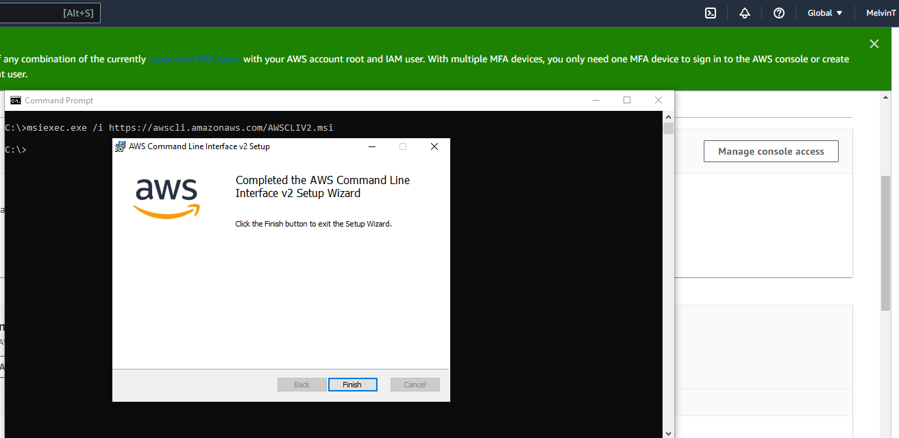
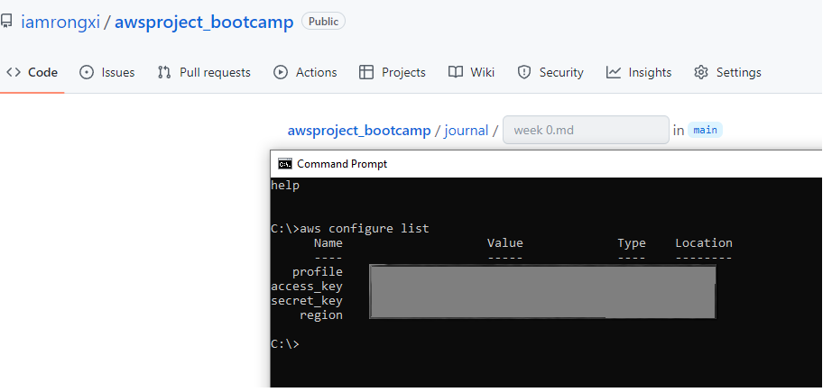

# Week 0 - Billing and Architecture

MY Journal - Start to learn and build strong AWS Foundation
Special thanks to Andrew and his wonderful 'Guru' Team!

## Required Homework/Tasks

### Installed AWS CLI

Managed to installed AWS CLI in my Windows 10 
 

CLI version info 

 
 ### Verified AWS CLI

### Create a Billing Alarm

### Create a Budget

