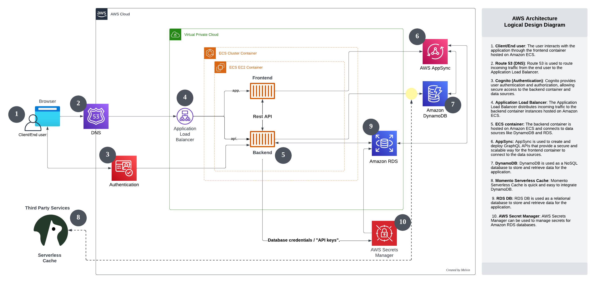

# Week 0 - Billing and Architecture

MY Journal - Start to learn and build strong AWS Foundation
Special thanks to Andrew and his wonderful 'Guru' Team!

## Required Homework/Tasks

### Installed AWS CLI

Managed to installed AWS CLI in my Windows 10 
 

CLI version info 

 
 ### Verified AWS CLI

### Create a Billing Alarm
Created an notification alarm to my personal email address. 

### Create a Budget
Created a very low budget for AWS Bootcamp activities purpose. 

## Recreate AWS Logical Diagram 
Basically to added on few components in my Logical Diagram 
- Descirption for each important components/ AWS servics (To provide a clear and accessible overview of the solution that can be understood by individuals with varying levels of technical knowledge)
- Added Secret Manager in the diagram, to have an extra layer of protection 

[Logical Diagram Lucidchart URL](https://lucid.app/lucidchart/eb75e538-1159-4e5c-a4de-b034fc11fd20/edit?viewport_loc=-1267%2C-676%2C3664%2C1685%2C0_0&invitationId=inv_0f44a2a8-1532-4e8e-908b-48373e111272)[Kindly review and comment.Appreciated your help]
